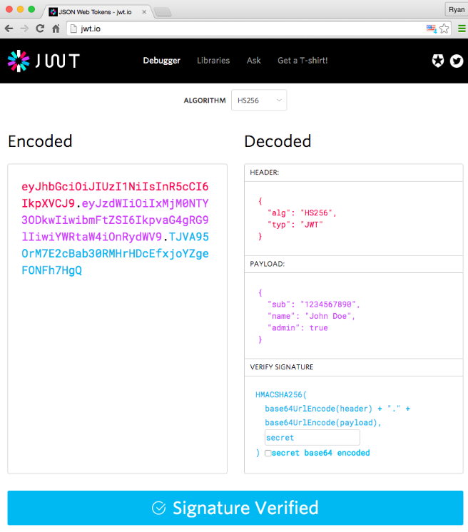
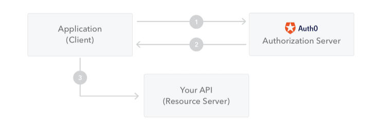

# JSON Web Token

JSON Web Token (JWT) is an open standard (RFC 7519) that defines a compact and self-contained way for securely transmitting information between parties as a JSON object. 
This information can be verified and trusted because it is digitally signed.

- Although JWTs can be encrypted to also provide secrecy between parties, we will focus on signed tokens. 

- Signed tokens can verify the integrity of the claims contained within it,

Here are some scenarios where JSON Web Tokens are useful:

- Authorization: : This is the most common scenario for using JWT. Once the user is logged in, each subsequent request will include the JWT, allowing the user to access routes, services, and resources that are permitted with that token.

- Information Exchange : JSON Web Tokens are a good way of securely transmitting information between parties

In its compact form, JSON Web Tokens consist of three parts separated by dots (.), which are:

- Header
- Payload
- Signature

Therefore, a JWT `xxxxx.yyyyy.zzzzz`

- Header : The header typically consists of two parts: the type of the token, which is JWT, and the signing algorithm being used, such as HMAC SHA256 or RSA.

- Payload :The second part of the token is the payload, which contains the claims. Claims are statements about an entity (typically, the user) and additional data. There are three types of claims: registered, public, and private claims.

- Signature : To create the signature part you have to take the encoded header, the encoded payload, a secret, the algorithm specified in the header, and sign that.

```
HMACSHA256(
  base64UrlEncode(header) + "." +
  base64UrlEncode(payload),
  secret)
```

- Putting all together : The output is three Base64-URL strings separated by dots that can be easily passed in HTML and HTTP environments, while being more compact when compared to XML-based standards such as SAML.



# How do JSON Web Tokens work

 diagram shows how a JWT is obtained and used to access APIs or resources:




# When should you use JSON Web Tokens 

 JSON Web Tokens (JWT) when compared to Simple Web Tokens (SWT) and Security Assertion Markup Language Tokens (SAML).

 As JSON is less verbose than XML, when it is encoded its size is also smaller, making JWT more compact than SAML

 Security-wise, SWT can only be symmetrically signed by a shared secret using the HMAC algorithm. However, JWT and SAML tokens can use a public/private key pair in the form of a X.509 certificate for signing

 # How JWT work

