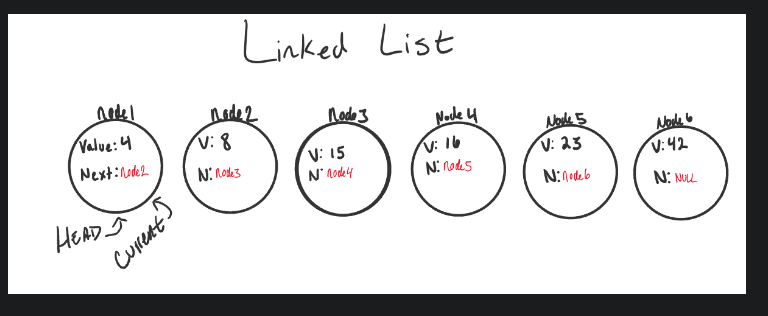

# Big O: Analysis of Algorithm Efficiency

 Big O(oh) notation is used to describe the efficiency of an algorithm or function. 
 
 This efficiency is evaluated based on 2 factors

 - Running Time (also known as time efficiency / complexity)
 The amount of time a function needs to complete.
 
 - Memory Space (also known as space efficiency / complexity)
The amount of memory resources a function uses to store data and instructions.

Big O’s role in algorithm efficiency is to describe the Worst Case of efficiency an algorithm can have in performing it’s job.

4 Key Areas for analysis :

- Input Size : refers to the size of the parameter values that are read by the algorithm.

- Units of Measurement : To evaluate a function for Time and Space complexity, we need a way to measure each of these factors.

we will consider Three Measurements of time:
- The time in milliseconds from the start of a function execution until it ends.
- The number of operations that are executed.

- The number of “Basic Operations” that are executed

In order to quantify Memory Space, we can consider Four Sources of Memory Usage during function run-time:

- The amount of space needed to hold the code for the algorithm

- The amount of space needed to hold the input data
 
- The amount of space needed for the output data.

- The amount of space needed to hold working space during the calculation.
---


- Orders of Growth

We can describe overall efficiency by using the input size n and measuring the overall Units of Space and Time required for the given input size n. As the value of n grows, the Order of Growth represents the increase in Running Time or Memory Space.

- Constant Complexity 
```
ALGORITHM Sum(number a, number b)


   number val <-- a + b
   return val
   ```

- Best Case, Worst Case, and Average Case

Logarithmic Complexity

``` AlGORITHM Search(SortedArray[0...n - 1], int SearchValue)

    number mid <-- n/2

    firstHalf <-- SortedArray[0...mid]
    secondHalf <-- SortedArray[mid...n]
    current <-- SortedArray[mid]

    if current > SearchValue
          return Search(firstHalf, SearchValue)
    if current < SearchValue
          return Search(secondHalf, SearchValue)

    return current 
```

 Linear Complexity

 ``` 
 ALGORITHM SumArray(arr[0...n - 1])

    number sum <-- 0

    for number i <-- 0 to n - 1 do
          sum <-- sum + arr[i]

    return sum   
    
```
Linearithmic Complexity

```
ALGORITHM SearchArrays(arrs n)

    // this is a linear O(n) operation that simply passes each sub array into `Search`
    for number i <-- 0 to n - 1 do
       array subArr <-- arrs[i]

       // Our previous analysis of `Search` tells us this has O(lgn) complexity.
       Search(subArr)
```

Quadratic Complexity

```
ALGORITHM BubbleSort(arr[0...n - 1])

    for number i <-- 0 to n - 1 do

       for number j <-- 0 to n - i - 1 do

          if arr[j] > arr[j + 1]
             Swap(arr[i], arr[j])
```
Factorial Complexity

```
combination: card[]

ALGORITHM FiftyTwoFactorial(
    combination[] generatedCombinations
    card[] currentCardCombination
    card[] cardsToCombine
)
  
    if cardsToCombine is not Empty
       for currentCard in cardsToCombine do
          nextCombination <-- currentCardCombination + currentCard
          remainingCards <-- remove currentCard from cardsToCombine
          FiftyTwoFactorial(generatedCombinations, nextCombination, remainingCards)

    else
       add currentCardCombination to generatedCombinations

    return generatedCombinations
 ```


Big O: The worst case analysis of algorithm efficiency.

Running Time: The amount of time required for an algorithm to complete.

Memory Space: The amount of memory resources required for an algorithm to complete.

Input Size: Represented by the variable n, the total size of values used as parameters in an algorithm.

Big Omega: The best case analysis of algorithm efficiency.

Big Theta: The typical or random case used for analysis of algorithm efficiency.


---
# Linked Lists:

- A Linked List is a sequence of Nodes that are connected/linked to each other. The most defining feature of a Linked List is that each Node references the next Node in the link.

There are two types of Linked List 

- Singly and Doubly.




---

# linear data structures

One characteristic of linked lists is that they are linear data structures, which means that there is a sequence and an order to how they are constructed and traversed. We can think of a linear data structure like a game of hopscotch: in order to get to the end of the list, we have to go through all of the items in the list in order, or sequentially. Linear structures, however, are the opposite of non-linear structures. In non-linear data structures, items don’t have to be arranged in order, which means that we could traverse the data structure non-sequentially.


- Memory management


Lists for all shapes and sizes
Even though the parts of a linked list don’t change, the way that we structure our linked lists can be quite different. Like most things in software, depending on the problem that we’re trying to solve, one type of linked lists might be a better tool for the job than another.
