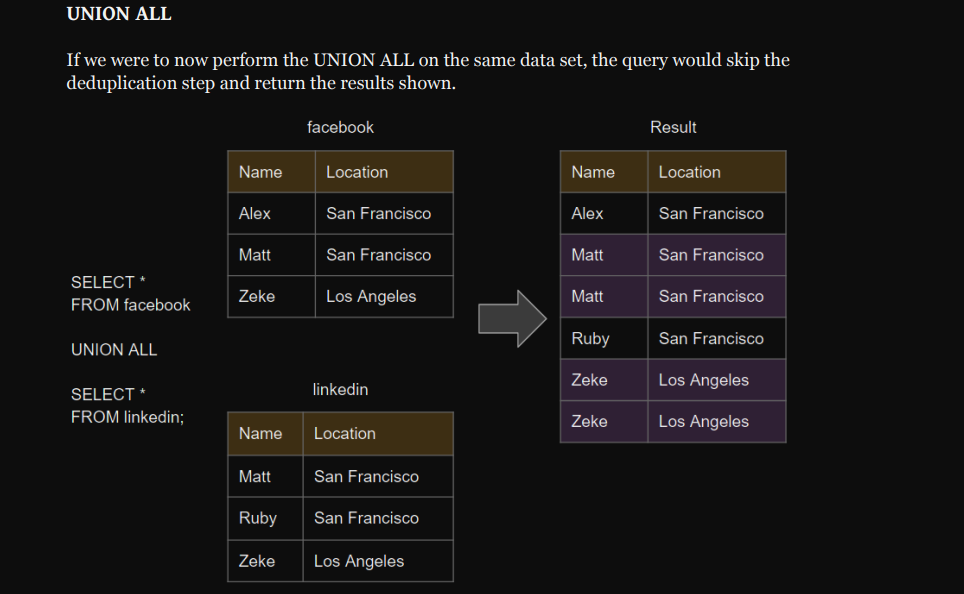

# ` Basic SQL`

``` 
SQL stands for Structured Query Language .
```
```
SQL is a computer language for working with sets of facts and the relationships between them.
Relational database programs
```
- SELECT 

To describe a set of data by using SQL, you write a SELECT statement

ex.
``` 
SELECT age FROM presidents WHERE name = 'Barack Obama';
```
- From 

SELECT data FROM a specific table.

- Splat (*)

 frequently used shortcut to get all columns.

- ORDER BY 

Specifies how to sort the results.

DESC  | |  ASC

- LIMIT 

If want to LIMIT the number of results that are returned you can simply use the LIMIT
command with a number of rows to LIMIT by.

```
SELECT * FROM artists LIMIT 3;
```


- OFFSET

You can also specify an OFFSET from where to start returning data.

```
SELECT * FROM artists LIMIT 5 OFFSET 2;
```


- WHERE 

The WHERE command is followed by the conditions you’d like to
filter by.

```
SELECT * FROM artists WHERE [Filter Conditions];
```
 Conditions are simply statements that are either true or false

 ```
 SELECT * FROM artists WHERE name = 'Santana';

```
Multiple matches

You can add additional conditions by
using the AND || OR || NOT operator between each new condition

---

## ` Operators`

```
Operator Description
=          equal
<          less than
>          greater than
<=         less than or equal
>=         greater than or equal

!=         not equal
<> not equal (yup, there are two ways)
```
- LIKE  : a string matches a pattern
- ILIKE : case insensitive version of LIKE

- SIMILAR TO

- Dealing with NULLs

IS NULL -- matches NULL values

IS NOT NULL -- matches all non NULL values

---


- SCHEMA

The word SCHEMA is used to describe a collection of tables and their relationships in your
database.

---
# `Aggregate Functions`

```
Function Description
MAX returns the largest (maximum) number in a sets
MIN described
COUNT returns a count of the # of values in a set
COUNT DISTINCT returns a count of the # of unique (distinct) values in a set
EVERY returns true if all data inside is true (same as bool_and)
AVG returns the average (mean) of the set of numbers
SUM returns the sum of all the values in the set
```

---

- GROUP BY

There are a few rules to follow when using GROUP BYs. The largest is that all data that
isn’t listed as a parameter to GROUP BY needs an aggregation function applied to it. Think
of what the following query

```
SELECT genre_id, unit_price FROM tracks GROUP BY genre_id;
```
---

# `JOIN Relationships and JOINing`

possible to JOIN tables together to fetch results from both

- Relationships

Relationships are defined in each tables by
connecting Foreign Keys from one table to a Primary Key in another.

- Primary Keys

A primary key is a column (or sometimes set of columns) in a table that is a unique
identifier for each row.
 

 It is very common for databases to have a column named id (short
for identification number) 


- Foreign Keys

Foreign keys are columns in a table that specify a link to a primary key in another table. A
great example of this is the artist_id column in the albums table. It contains a value of the
id of the correct artist that produced that album.


---
``JOINing Tables``

```
SELECT * FROM [table1] JOIN [table2] ON [table1.primary_key] = [table2.foreign_key];
```

We can even join all 3 tables together if we’d like using multiple JOIN commands

- INNER JOIN
- RIGHT OUTER JOIN
- LEFT OUTER JOIN
- FULL OUTER JOIN
- Bringing it All Together

---

# `DATE and TIME Functions`

many queries deal with DATE and TIME information that it’s
important to get to know the date tools.

```
Data Type Description Example Output
TIMESTAMP date and time TIMESTAMP '2019-12-10
01:14:25'
2019-12-
10T01:14:25
DATE date (no time) DATE '2019-12-10 01:14:25' 2019-12-10
TIME time (no day) TIME '2019-12-10 01:14:25' 01:14:25
INTERVAL interval between two
date/times
INTERVAL '1 day 2 hours 10
seconds' 1 day, 2:00:10
```
---

- `UNION and UNION ALL`

UNION and UNION ALL are SQL operators used to concatenate 2 or more result sets.

- UNION: only keeps unique records


- UNION ALL: keeps all records, including duplicates




---

# `AND OR Boolean Logic`

Boolean AND / OR logic can be visualized with a truth table
Truth tables two to the number of inputs rows in them

1 - true

0 - false

Short Circuit Logic
If the first input guarantees a specific result, then the second output will not be
read
AND - first input of false will short circuit to false
OR - first input of true will short circuit to true

```
SELECT * FROM [table]
WHERE
[column A]=5 AND [column B]=22;


Example of a CASE-WHEN Statement
CASE
WHEN [column A]=21 OR [column B]=7 THEN [Action]
END

```
---

## Copying Data Between Tables

CREATE TABLE [Table to copy To]

AS [Table to copy From]

WITH NO DATA;

Copy into a new pre-structured table:

```
“WITH NO DATA” specifies that the new table should only copy the table structure
with no data
```

Copy into pre-existing table:
```
INSERT INTO [Table to copy To]
SELECT [Columns to Copy]
FROM [Table to copy From]
WHERE [Optional Condition];
```

---

# PostgreSQL

I Use sql language

DDL 

- create 
- drop 
- alter 

DMl to edit rows 

    - insert 
    - update
    - delete
    - select

